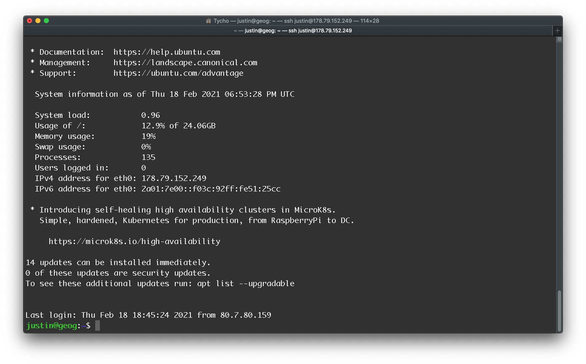
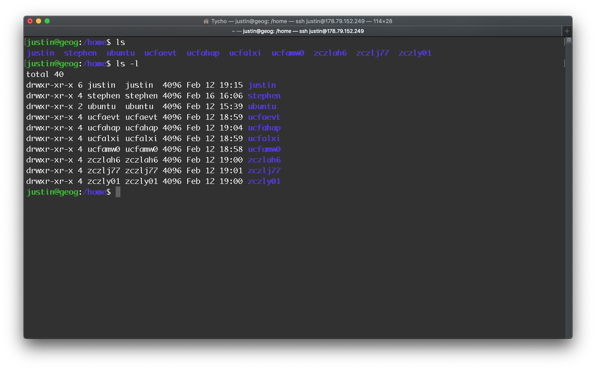
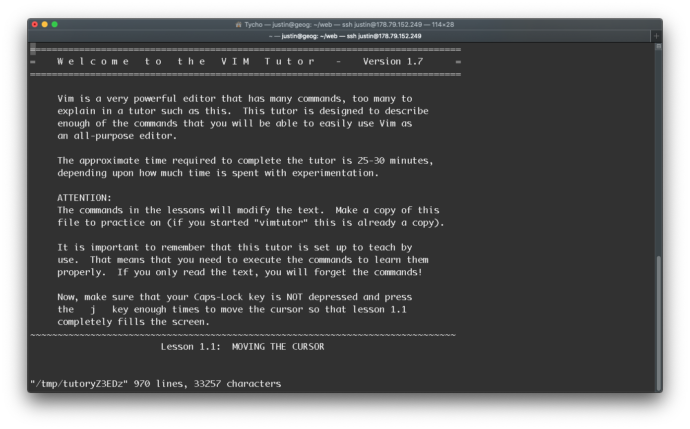

# (PART\*) Data Sciencist's Toolbox {-}

# Unix tools

## Introduction {#intro-w08}
Over the past months, you have learned all about advanced topics in the domains of spatial analysis and machine learning. However, in your career as a data scientist or researcher you are also very likely to encounter having to work in a command line environment. For instance, because you need to run your code or analysis on a dedicated high-performance machine or because you have created some maps that you want to host on a website. To do this, and to take full advantage of the tools that your computer provides, this week we will be working with a text interface: [the Shell](https://en.wikipedia.org/wiki/Shell_(computing)). A shell is a computer program which exposes an operating system's services to a human user or other program. Although several shell programmes exist, at their core they are all roughly the same: they allow you to run programmes from within a textual environment. 

This week we will focus on one of the most widely used shells: **bash** ([Bourne Again SHell](https://en.wikipedia.org/wiki/Bash_(Unix_shell))). We will look into accessing a remote server, using some basic commands and programmes, and using some Unix tools for basic data wrangling tasks. The lecture videos this week are provided by [Dr Balamurugan Soundararaj](https://cityfutures.be.unsw.edu.au/about-us/our-profiles/dr-balamurugan-soundararaj/), who obtained a Masters' degree from [CASA](https://www.ucl.ac.uk/bartlett/casa/) and a PhD from [UCL Geography](https://www.geog.ucl.ac.uk/), is an avid Unix user and made extensive use of Unix tools to set up a data processing pipeline for [his PhD research](https://github.com/sbmkvp/phd_thesis). 

Let's get started!

#### Video: Introduction W08 {-}
```{r 08-short-lecture-welcome, warnings=FALSE, message=FALSE, echo=FALSE}
library(vembedr)
embed_msstream('') %>% use_align('left')
```
[Lecture slides] [[Watch on MS stream]]()

```{r 08-settings, warnings=FALSE, message=FALSE, echo=FALSE}
# settings
options(max.print=30)
```

### Reading list {#reading-list-w08}
Because this week's tutorial material is rather extensive and has a strong practical focus, we only have one article as suggested reading this week.

#### Suggested reading {-}
- Soundararaj, B. *et al.*. 2019. Medium Data Toolkit-A Case Study on Smart Street Sensor Project. *Proceedings of the 27th Conference of GIS Research UK (GISRUK)*. Newcastle: Newcastle University. [[Link]](https://www.researchgate.net/publication/333774622_Medium_Data_Toolkit_-A_Case_study_on_Smart_Street_Sensor_Project)

### Technical Help session
Every Thursday between 13h00-14h00 you can join the **Technical Help** session on Microsoft Teams. The session will be hosted by [Alfie](https://www.ucl.ac.uk/geospatial-analytics/people/alfie-long). He will be there for the whole hour to answer any question you have live in the meeting or any questions you have formulated beforehand. If you cannot make the meeting, feel free to post the issue you are having in the Technical Help channel on the GEOG0125 Team so that Alfie can help to find a solution. 

## Bourne Again SHell (BASH)
Bash is a Unix shell and command language. It is free software and has been distributed widely as the default login shell for most Linux distributions and Apple’s macOS, a version is also available for Windows. To open a shell prompt, which is where you can type commands, you first need a terminal. 

### Installation
#### Windows {-}
1. Download the [Git for Windows installer](https://gitforwindows.org/). It depends on your machine, but you probably need the *Git-2.30.1-64-bit.exe* version.
2. Run the installer and follow the steps below:
- Click on *next* four times (two times if you've previously installed Git). You don't need to change anything in the "information", "location", "components", and "start menu" screens.
- From the dropdown menu select "Use Vim (the ubiquitous text editor as Git's default editor". Click *next.*
- On the page that says "Adjusting the name of the initial branch in new repositories", leave the default as "Let Git decide". Click *next.*
- Leave the" "Git from the command line and also from 3rd-party software" button selected and click on *next*.
- Ensure that "Use the native Windows Secure Channel Library" is selected and click on *next*.
- Ensure that "Checkout Windows-style, commit Unix-style line endings" is selected and click on *next*.
- Ensure that "Use Windows' default console window" is selected and click on *next*.
- Ensure that "Default (fast-forward or merge) is selected and click *next*.
- Ensure that "Do not use a credential help" is selected and click on *next*.
- Ensure that "Enable file system caching" is selected and click on *next*.
- Ensure that "Enable experimental support for pseudo consoles" is not selected (default) and click on *install*.
- Click on *finish* or *next*.
3. If your **HOME** environment variable is not set (or you don't know what this is):
  - open command prompt (Open Start Menu then type *cmd* and press Enter)
  - Type the following line into the command prompt window exactly as shown:
    `setx HOME "%USERPROFILE%"`
  - Press *enter*. You should see: `SUCCESS: Specified value was saved.`
  - Quit command prompt by typing `exit` then pressing *enter*.
4. You can now open the programme *Git Bash*.

#### macOS {-}
The default shell in some versions of macOS is Bash, and Bash is available in all versions, so no need to install anything. You access Bash from the **Terminal** (found in /Applications/Utilities). 

#### Linux {-}
The default shell is usually Bash and there is usually no need to install anything. If you are running a distribution like [Ubuntu Desktop](https://ubuntu.com/) you can also access Bash from the **Terminal**. 

### Getting started
Now everyone should have access to a terminal, either by installing *Git Bash* or directly through your operating system, we can get started. In order to make sure that everyone has access to the same tools and functionality, we will use our terminal to log into a server that we have created specifically for this course. In the following, we will log in to this server through something called [ssh](https://www.ssh.com/ssh/) (Secure Shell). The SSH protocol uses encryption to secure the connection between a client and a server. Start your terminal and type in the following:

```{bash eval=FALSE}
ssh username@178.79.152.249
```

<div class="note">
**Note**<br/>
You can find your username and password on Moodle.
</div>

When you log in for the first time, you will get a message that `The authenticity of host 178.79.152.249 can't be established` together with the question whether you want to continue connecting. Simply type **yes** and hit enter to log on to the server. You terminal window should now look similar to Figure \@ref(fig:login-server).

```{r login-server, echo=FALSE, warning=FALSE, message=FALSE, fig.cap='Enter the Matrix.', fig.align='center'}

```

Now we have successfully logged onto the server, you will see a prompt that looks like this: `username@geog:~$`. This is the main textual interface to the shell. It tells you that you are on the machine *geog* and that your "current working directory", or where you currently are, is `~` (short for "home"). The `$` tells you that you are not the root user (the root user can do many things an ordinary user cannot). At this prompt you can type a command, which will then be interpreted by the shell. The most basic command is to execute a program:

```{bash}
date
```

Here, we executed the `date` program, which (perhaps unsurprisingly) prints the current date and time. The shell then asks us for another command to execute. We can also execute a command with arguments:

```{bash}
echo hello
```

In this case, we told the shell to execute the program `echo` with the argument "hello". The echo program simply prints out its arguments, similar to `print()` in R or Python. 

<div class="note">
**Note**<br/>
The shell parses the command by splitting it by whitespace, and then runs the program indicated by the first word, supplying each subsequent word as an argument that the program can access. If you want to provide an argument that contains spaces or other special characters (e.g., a directory named "My Documents"), you can either quote the argument with `'` or `"` (`"My Documents"`), or escape the relevant characters with `\` (`My\\ Documents`).
</div>

But how does the shell know how to find the date or echo programmes? The shell is a programming environment, just like Python or R, and so it has variables, conditionals, loops, and functions. When you run commands in your shell, you are really writing a small bit of code that your shell interprets. If the shell is asked to execute a command that does not match one of its programming keywords, it consults an environment variable called `$PATH` that lists which directories the shell should search for programmes when it is given a command:

```{bash}
echo $PATH
```

When we run the echo command, the shell sees that it should execute the program `echo`, and then searches through the `:`-separated list of directories in `$PATH` for a file by that name. When it finds it, it runs it. We can find out which file is executed for a given program name using the which program. We can also bypass `$PATH` entirely by giving the path to the file we want to execute. You may have encountered working with this `$PATH` variable already when you are using [miniconda](https://docs.conda.io/en/latest/miniconda.html) to manage your virtual environments - conda has to be added to the `PATH` variable to be available; e.g. in case of `conda env list` the shell will find `conda` by consulting the `PATH` variable and in case this has not been set up properly you will get a `conda: command not found` message.

A (file) path on the shell is a delimited list of directories; separated by `/` on Linux and macOS and `\` on Windows. On Linux and macOS, the path `/` is the "root" of the file system, under which all directories and files lie, whereas on Windows there is one root for each disk partition (e.g., `C:\`). Because we are working on the `GEOG0125 Linux server` we will use `/` for the remainder of this tutorial. A path that starts with `/` is called an absolute path. Any other path is a relative path. Relative paths are relative to the current working directory, which we can see with the `pwd` command and change with the `cd` command. Again, this is not very different than how you deal with paths in R and Python. In a path, `.` refers to the current directory, and `..` to its parent directory. To see what lives in a given directory, we use the `ls` command. Try out out these commands to navigate the server.

```{r navigating, echo=FALSE, warning=FALSE, message=FALSE, fig.cap='Navigating in the shell.', fig.align='center'}
knitr::include_graphics('images/w08/navigating.png')
```

Unless a directory is given as its first argument, `ls` will print the contents of the current directory. Most commands accept flags and options (flags with values) that start with `-` to modify their behaviour. Usually, running a program with the `-h` or `--help` flag will print some help text that tells you what flags and options are available. For example, `ls --help` tells us: that the `-l` flag uses a long listing format and gives us additional information about each file or directory present.

```{r long-list, echo=FALSE, warning=FALSE, message=FALSE, fig.cap='Using the `-l` flag with `ls`.', fig.align='center'}

```

In the shell, programmes have two primary "streams" associated with them: their **input stream** and their **output stream**. When the program tries to read input, it reads from the input stream, and when it prints something, it prints to its output stream. Normally, a program’s input and output are both your terminal. That is, your keyboard as input and your screen as output. However, we can also rewire those streams. The simplest form of redirection is `< file` and `> file`. These let you rewrite the input ("standard input") and output ("standard output") streams of a programme to a file respectively. Navigate to your home directory (i.e. `/home/username`) and try the following:

```{bash eval=FALSE}
# redirect echo to file
echo hello > hello.txt

# output content of file to terminal
cat hello.txt

# output content of file to terminal
cat < hello.txt
```

You can also use `>>` to append to a file. Where this kind of input/output redirection really shines is in the use of pipes. The `|` operator lets you *chain* programmes such that the output of one is the input of another. We will come back to this later. For now, some other useful commands are:

| command   | action  |
| :--       | :------ |
| `ls`      | list directory contents |
| `echo`    | print text to the terminal window |
| `touch`   | creates a file |
| `mkdir`   | creates a directory |
| `grep`    | search text for patterns |
| `man`     | print manual or get help for a command |
| `pwd`     | print working directory |
| `mv`      | move or rename file or directory |
| `head`    | read the start of a file |
| `tail`    | read the end of a file |
| `cat`     | concatenate file (e.g. view file contents |
| `history` | list your most recent commands |
| `clear`   | clear your terminal window |
| `cp`      | copy files or directory |
| `rm`      | remove a file |

<div class="note">
**Note**<br/>
Be very careful with using the `rm` file: if you use `rm` to delete a file the file will be gone completely and you cannot "recover it from the trash" because there is no trash can for `rm`!
</div>

### Exercise
Try to do the following, using the `man` programme or `--help` flag when you are stuck:

1. Create a new directory called `data` in your home directory (`/home/username`).
2. Use `touch` to create a new file called `data.txt`.
3. Add three lines of data to `data.txt`; it does not matter what you add to the file!.
4. Inspect the file with `head` and `tail`.
5. Rename the file to `data_renamed.txt`.

## Text editing
When working in a server environment, you will spend some time reading, navigating, and editing code, so it is worthwhile to spend a little attention to text editors. Programmers have very strong opinions about their text editors, but one of the most popular command-line-based text editor is [Vim](https://www.vim.org/). Vim has a rich history; it originated from the Vi editor (1976), and it is still being developed today. When programming, you spend most of your time reading/editing, not writing. For this reason, Vim is a modal editor: it has different modes for inserting text and manipulating text. The following operating modes are available:

- *Normal*: for moving around a file and making edits
- *Insert*: for inserting text
- *Replace*: for replacing text
- *Visual*: for selecting blocks of text
- *Command-line*: for running a command

Keystrokes have different meanings in different operating modes. For example, the letter `x` in Insert mode will just insert a literal character "x", but in Normal mode, it will delete the character under the cursor, and in Visual mode, it will delete the selection. In its default configuration, Vim shows the current mode in the bottom left. The initial/default mode is Normal mode. 

<div class="note">
The usage of different modes and navigating around Vim can be a little difficult in the beginning. The question "[how do I exit the Vim editor](https://stackoverflow.com/questions/11828270/how-do-i-exit-the-vim-editor)" has over 4,000 upvotes on stackoverflow! 
</div>

You change modes by pressing `ESC` (the escape key) to switch from any mode back to Normal mode. From Normal mode, enter Insert mode with `i`, Replace mode with `R`, Visual mode with `v`, Visual Line mode with `V`, Visual Block mode with `ctrl` + `v`, and Command-line mode with `:`.

#### Inserting text {-}
From Normal mode, press `i` to enter Insert mode. Now, Vim behaves like any other text editor, until you press *<ESC>* to return to Normal mode. This, along with the basics explained above, are all you need to start editing files using Vim.

#### Buffers, tabs, and windows {-}
Vim maintains a set of open files, called *buffers*. A Vim session has a number of tabs, each of which has a number of windows (split panes). Each window shows a single buffer. Unlike other programmes you are familiar with, like web browsers, there is not a 1-to-1 correspondence between buffers and windows; windows are merely views. A given buffer may be open in multiple windows, even within the same tab. This can be quite handy, for example, to view two different parts of a file at the same time. By default, Vim opens with a single tab, which contains a single window.

#### Command-line {-}
Command mode can be entered by typing `:` in Normal mode. Your cursor will jump to the command line at the bottom of the screen upon pressing `:`. This mode has many functionalities, including opening, saving, and closing files, and quitting Vim.

| command   | action  |
| :--       | :------ |
| `:q`      | quit (close Vim) |
| `:w`      | write (save) |
| `:wq`     | write (save file) and quit Vim |
| `:e {*name of file*}` | open file for editing |
| `:ls`     | show open buffers |

#### Movement {-}
You should spend most of your time in Normal mode, using movement commands to navigate the buffer. Some useful movement commands:

| command   | action  |
| :--       | :------ |
| `hjkl`    | basic movement (left, down, up, right) |
| `w`       | next word |
| `b`       | beginning of word |
| `e`       | end of word |
| `0`       | beginning of line |
| `$`       | end of line |
| `H`       | top of screen |
| `M`       | middle of screen |
| `L`       | bottom of screen |
| `ctrl` + `u` | scroll up |
| `ctrl` + `d` | scroll down |

#### Selection {-}
From Normal mode, press `v` to enter Visual mode, `V` to enter Visual Line mode, and `ctrl` + `v` to enter Visual Block mode. You can use movement keys to select text.

#### Edits {-}
For some more advanced editing, i.e. outside of the Insert mode `i`, some useful commands are:

| command   | action  |
| :--       | :------ |
| `o `      | insert line below |
| `O`       | insert line above |
| `dw `     | delete word |
| `d$`      | delete till end of line |
| `d0`      | delete to beginning of line |
| `x`       | delete character |
| `s`       | subsitute character |
| `u`       | undo |
| `y`       | yank (copy)
| `p`       | paste

#### Customising Vim {-}
Vim is customisable through a plain-text configuration file in `~/.vimrc` (containing Vimscript commands) and there are also tons of plugins for extending Vim, however, this is out of the scope of this tutorial. Interesting fact: Dr Soundararaj actually used his customed Vim installation to write [his entire PhD thesis](https://github.com/sbmkvp/phd_thesis).

#### Video: MIT's Missing Semester: Vim {-}
For a more in-depth introduction to Vim than provided here, do have a look at the lecture video that is part of MIT's [Missing Semester course](https://missing.csail.mit.edu/) on which lots of this week's material is based.

```{r 08-vim, warnings=FALSE, message=FALSE, echo=FALSE}
embed_youtube('a6Q8Na575qc') %>% use_align('left')
```

### Exercise
Vim has a built-in tutorial (`vimtutor`) that comes installed with Vim. You can start it simply by typing `vimtutor` in your shell. Complete the `vimtutor` to get comfortable moving around Vim. You do not need to become an expert in Vim, unless you want to, but just be comfortable enough to access and edits files.

```{r vim-tutor, echo=FALSE, warning=FALSE, message=FALSE, fig.cap='Vimtutor.', fig.align='center'}

```

## Data wrangling
Now we know how to navigate the terminal as well as view and edit files, we can have a look at some basic *data wrangling* tasks. Earlier we mentioned that input/output redirection is really useful when using pipes (the `|` operator) because it allows you to *chain* programmes such that the output of one is the input of the other. Let's move to the `data` directory we created earlier (`home/username/data`) and try this out with a very simple example.

```{bash eval=FALSE}
# move to your data directory
cd /home/username/data

# copy file "file_a" to your data directory
cp /home/justin/data/file_a ./

# copy file "file_b" to your data directory
cp /home/justin/data/file_b ./

# inspect
head file_a file_b
```

Both files contain address references. Although these are artificial data, these address references could, for instance, have been created during an [address-matching procedure](https://rss.onlinelibrary.wiley.com/doi/abs/10.1111/rssa.12476) where raw address strings have been matched to a database containing georeferenced address strings. For this example: let's say that we tried running some address matching code two times with slightly different parameters on the same input dataset. `file_a` and `file_b` contain the address references of all processed addresses. Unfortunately, whilst everything worked fine during our first run (`file_a`), our second run (`file_b`) did not completely finish. We now want to know whether addresss reference `a46034025` is part of our results. We also want to figure out which of the address records did not get processed so we can restart our address matching procedure without having to rerun the analysis on the full dataset again. 

```{bash}
# count the number of lines in file a
wc -l file_a

# count the number of lines in file b
wc -l file_b
```

When quickly inspecting the number of lines using `wc -l`, we can indeed see that the `file_a` contains more values than `file_b`. To filter out data, and see if address reference `a46034025` is present in both files we can use the `grep` programme

```{bash}
# grep a46034025
grep a46034025 file_a

# grep a46034025
grep a46034025 file_b
```

Now, let's try to filter `file_a` using `file_b`. Any idea what the flags (`-Fxvf`) do that have been provided to `grep`?

```{bash}
# get difference
grep -Fxvf file_b file_a > file_c

# inspect
head file_c

# inspect
wc -l file_c
```

But what if we only want to now the differences in number of lines within each file? Let's try if we can combine `grep` with `wc -l`.

```{bash}
# get difference
grep -Fxvf file_b file_a | wc -l
```

In this example the output stream from grep (i.e. the addresses that are not present in `file_a`) serve as input to `wc -l`. This may seem trivial, however, this is very powerful. You could think of a situation where you go through a file, perform a database query, analyse the results of this query in a Python script, and push these analysis result to an R script to create a set of visualisations. You can also combine these pipelines in a bash scripts (`*.sh`). Anything you can run normally on the command line can be put into a script and it will do exactly the same thing. Similarly, anything you can put into a script can also be run normally on the command line and it will do exactly the same thing. We will not go into further details here but we will show you some examples during **Tuesday's seminar** of how this can be used to set up a processing pipeline that allows for parallel data processing.

## Copying data
Sometimes you will need to upload files to the server. For instance, you have created an analysis pipeline on your local machine and you know want to move this code to a high-performance machine for parallel processing. You can do this by making use of the **secure copy protocol** (SCP). Secure copy protocol (SCP) is a means of securely transferring computer files between a local host and a remote host or between two remote hosts - and this can be done through with the `scp` programme. 

In your terminal: navigate on your **local machine** (local host) to the file you want to copy to the server (remote host) and then use the following syntax to copy the file to your home directory: 

```{bash eval=FALSE}
# scp from local to remote host
scp file_you_want_to_copy username@178.79.152.249:/home/username/
```

The exact location to which the source file will be copied is specified by `username@178.79.152.249:/home/username/`, which includes:

- the name of the account on the destination computer (`username`);
- the hostname of the computer to which the source file will be copied (`178.79.152.249`); and, 
- the directory to which the source fill will be copied (`/home/username`). 

Give it a try with a **small file** you have on your own computer!

<div class="note">
**Note**<br />
Make sure to include a space between the source and destination paths. Also, be careful when copying files that share the same name on both hosts; you may accidentally overwrite data you intended to keep.
</div>

## Web
You may have noticed that in your home folder (`/home/username`) there is a folder called `web` which contains a file called `index.html`. We actually have set up the `GEOG0125 server` as a web server, meaning that the server is able to host some lightweight [HTML](https://en.wikipedia.org/wiki/HTML) pages. 
If you navigate to http://178.79.152.249/justin/ in your web browser you will actually notice that your individual `index.html` page is available through as well. Any changes you make in the `index.html` file (e.g. by updating or replacing the file) will automatically reflect on your personal page.
updating or replacing the `index.html` page in your home folder will be reflected in your browser.

<div class="note">
Your browser will display a notice when navigating to the `GEOG125 server` that the connection is not secure. This is for our purposes during this course nothing to worry about. The reason for this happening is because the server has not been set up with a SSL certificate. SSL certificates are a small data files that establish an encrypted link between a web server and a browser. This link ensures that all data passed between the web server and browser remain private. Because our server does not have a domain name associated (e.g. something like www.geog0125.co.uk) and can only be accessed by its IP address, we could not issue a certificate using the nonprofit Certificate Authority [Let's Encrypt](https://letsencrypt.org/).
</div>

### Assignment {-}
HTML is the foundation of all web pages. It defines the structure of a page, while CSS defines its style. In anticipation of next week's material where we will be looking at creating a web map using JavaScript and [Leaflet.js](https://leafletjs.com/), have a look at this HTML tutorial: https://www.w3schools.com/html/. We would recommend that you go through at least: [introduction](https://www.w3schools.com/html/html_intro.asp), [editors](https://www.w3schools.com/html/html_editors.asp) (although we would recommend using [Atom](https://atom.io/)), [basics](https://www.w3schools.com/html/html_basic.asp), [elements](https://www.w3schools.com/html/html_elements.asp), [attributes](https://www.w3schools.com/html/html_attributes.asp), [headings](https://www.w3schools.com/html/html_headings.asp), [paragraphs](https://www.w3schools.com/html/html_paragraphs.asp), [styles](https://www.w3schools.com/html/html_styles.asp), [formatting](https://www.w3schools.com/html/html_formatting.asp), [comments](https://www.w3schools.com/html/html_comments.asp), [colors](https://www.w3schools.com/html/html_colors.asp), [CSS](https://www.w3schools.com/html/html_css.asp), [links](https://www.w3schools.com/html/html_links.asp), [images](https://www.w3schools.com/html/html_images.asp), and [classes](https://www.w3schools.com/html/html_classes.asp). 

Of course, you do not need to become an expert in HTML and front-end web development and need to know everything in detail: but again try to get comfortable enough that you can adjust existing HTML code to make changes and that if you were to get stuck that you can find a solution using a targeted Google search. Try to play around with the HTML and CSS of your `index.html` page. You can use your newly acquired Vim skills to make adjustments to your file. Or you can create an `index.html` locally and when you are happy copy your local file to the server with `scp`.

## Take home message
This week we have introduced you to the Shell. At its core, a shell allows you to run programmes from within a textual environment. As a data scientist you will most likely run into this at some point: most likely because you need to run your code or analysis on a dedicated high-performance machine or because you have created some maps that you want to host on a website. This week really only introduced you to the very basics of working with bash and their are many, many more useful command line programmes

Some useful command line programmes that we have used ourselves in the past for a variety of tasks:

- [GNU parallel](https://www.gnu.org/software/parallel/) is a shell tool for executing jobs in parallel using one or more computers. A job can be a single command or a small script that has to be run for each of the lines in the input. The typical input is a list of files, a list of hosts, a list of users, a list of URLs, or a list of tables. A job can also be a command that reads from a pipe. GNU parallel can then split the input and pipe it into commands in parallel.
- [PostgreSQL](https://www.postgresql.org/) is a powerful, open source object-relational database. Whilst GUIs are available (e.g. [pgAdmin](https://www.pgadmin.org/)) `psql` is a terminal-based front-end to PostgreSQL. `psql` enables you to type in queries interactively, issue them to PostgreSQL, and see the query results. Alternatively, input can be from a file. In addition, it provides a number of meta-commands and various shell-like features to facilitate writing scripts and automating a wide variety of tasks.
- [Git](https://git-scm.com/) is a free and open source distributed version control system designed to handle everything from small to very large projects with speed and efficiency.
- [Miniconda](https://docs.conda.io/en/latest/miniconda.html) is a free minimal installer for conda. It is a small, bootstrap version of Anaconda that includes only conda, Python, the packages they depend on, and a small number of other useful packages, including pip, zlib and a few others.)
- [sed](https://www.gnu.org/software/sed/manual/sed.html) is a stream editor. A stream editor is used to perform basic text transformations on an input stream (a file or input from a pipeline).
- [Mapshaper](https://github.com/mbloch/mapshaper) is software for editing `Shapefile`, `GeoJSON`, `TopoJSON`, `csv` and several other data formats, written in JavaScript. Although technically written in JavaScript, mapshaper can be installed using [npm](https://www.npmjs.com/) and run from the command line.
- [ffmpeg](https://ffmpeg.org/) is a complete, cross-platform solution to record, convert and stream audio and video.

## Attributions {#attributions_w08}
This material was adapted from *The Missing Semester of your CS Education [The Shell, Editors (Vim), Data Wrangling)*. Cambridge, MA: Massachusetts Institute of Technology and is licensed under a Non Commercial-ShareAlike 4.0 International (CC BY-NC-SA 4.0). [[Link]](https://missing.csail.mit.edu/)