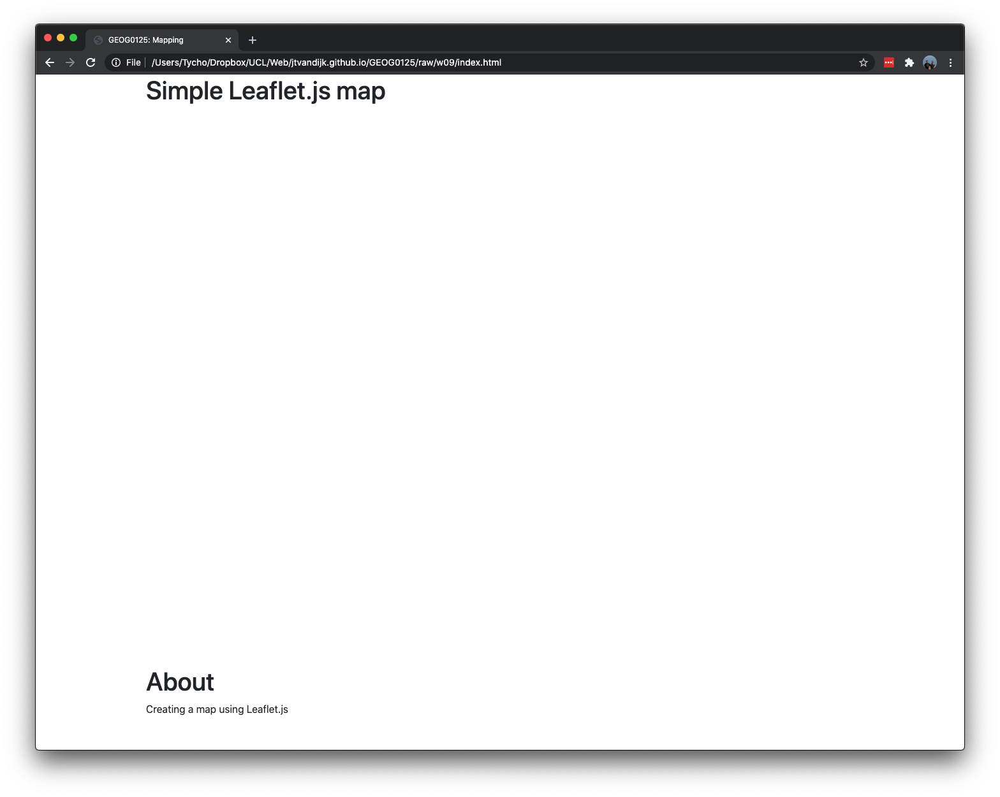
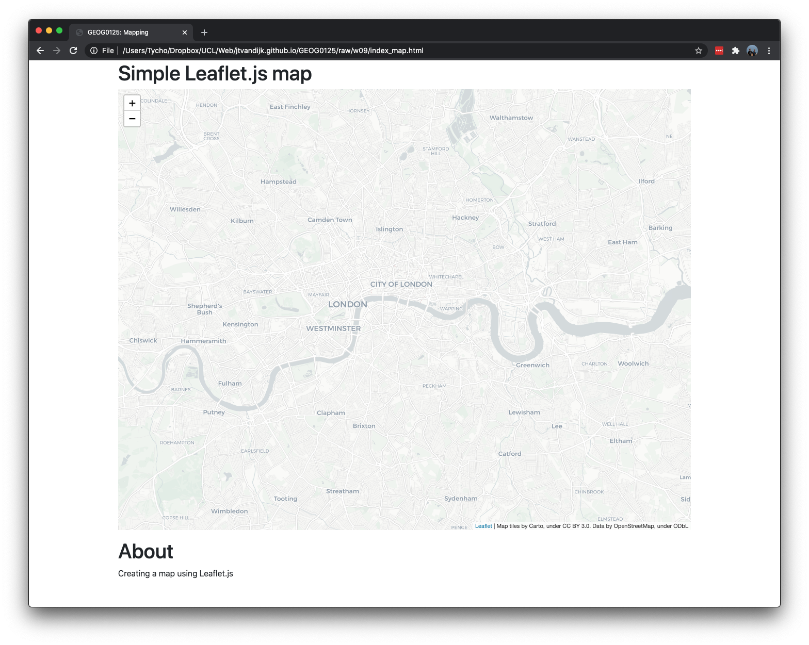
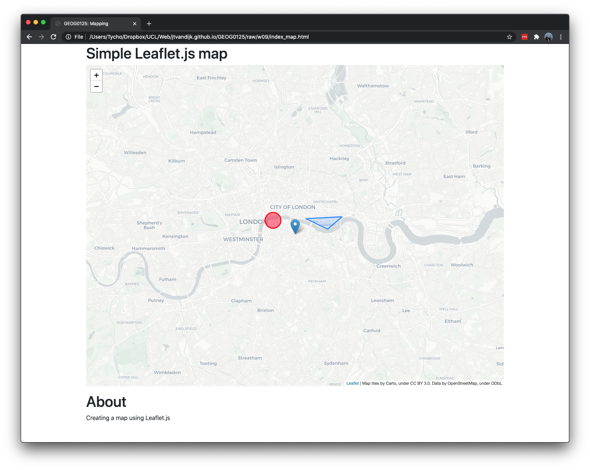
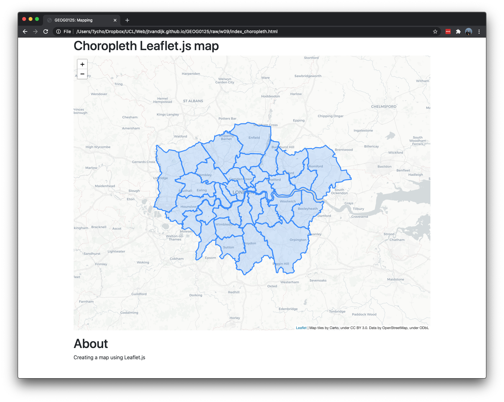
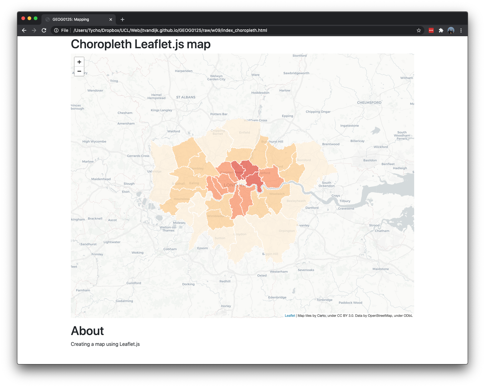
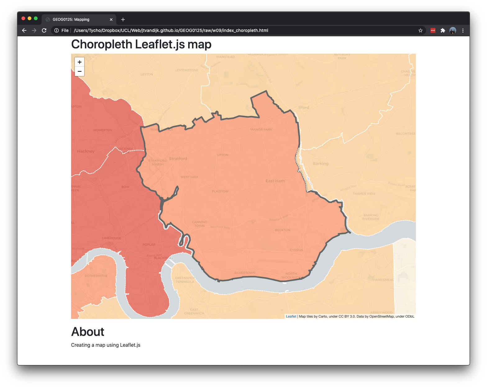
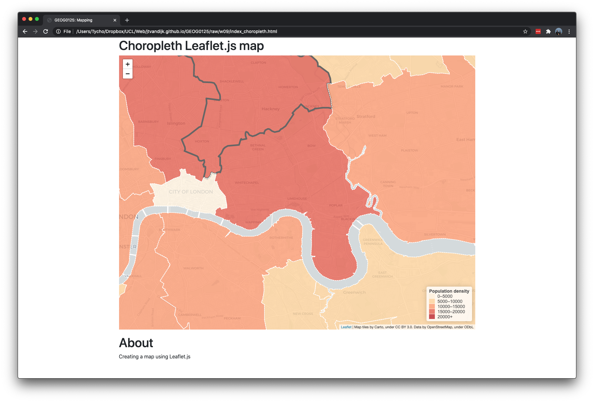

# Web Visualisation

## Introduction {#intro-w09}
Web mapping or online mapping is the process of using the maps delivered by geographic information systems (GIS) on the Internet. With ever-increasing numbers of large demographic data sets becoming available, many provided as open data, web mapping platforms can be used to facilitate the use and exploration of these datasets. Examples of such web mapping platforms are [DataShine](https://datashine.org.uk/), [CDRC Maps](https://maps.cdrc.ac.uk/), and [CDRC Mapmaker](https://mapmaker.cdrc.ac.uk/).

This week we will dive a little deeper into creating web maps. We will do this by looking at "the leading open-source JavaScript library for mobile-friendly interactive maps": [Leaflet.js](https://leafletjs.com/). Moreover, the lecture videos this week are provided by arguably the best mapmaker at UCL: [Oliver O'Brien](https://oobrien.com/). Oliver is a senior research associate at the UCL Department of Geography’s Geospatial Analytics and Computing group. He is interested in investigating and implementing new ways to visualise spatial and socioeconomic data, especially open datasets relating to transport, London and other urban areas. Oliver is also directly responsible for the creation of [DataShine](https://datashine.org.uk/), [CDRC Maps](https://maps.cdrc.ac.uk/), and the official maps for the [Scottish Index of Multiple Deprivation 2020](https://simd.scot/#/simd2020/BTTTFTT/9/-4.0000/55.9000/).

Let's get mapping!

#### Video: Introduction W09 {-}
```{r 09-short-lecture-welcome, warnings=FALSE, message=FALSE, echo=FALSE}
library(vembedr)
embed_msstream('d0273d51-09f6-41d0-a6eb-57f64b3462a1') %>% use_align('left')
```
[Lecture slides] [[Watch on MS stream]](https://web.microsoftstream.com/video/d0273d51-09f6-41d0-a6eb-57f64b3462a1)

```{r 09-settings, warnings=FALSE, message=FALSE, echo=FALSE}
# settings
options(max.print=30)
```

### Reading list {#reading-list-w09}
Because this week's tutorial material is rather extensive and has a strong practical focus, we only have two articles as suggested reading this week.

#### Suggested reading {-}
- O'Brien, O. and J. Cheshire. 2015. Interactive mapping for large, open demographic data sets using familiar geographical features. *Journal of Maps* 12(4): 676-683. [[Link]](https://doi.org/10.1080/17445647.2015.1060183)
- Van Dijk, J. T. and P. A. Longley. 2020. Interactive display of surnames distributions in historic and contemporary Great Britain. *Journal of Maps* 16(1): 68-76. [[Link]](https://www.tandfonline.com/doi/full/10.1080/17445647.2020.1746418)

### Technical Help session
Every Thursday between 13h00-14h00 you can join the **Technical Help** session on Microsoft Teams. The session will be hosted by [Alfie](https://www.ucl.ac.uk/geospatial-analytics/people/alfie-long). He will be there for the whole hour to answer any question you have live in the meeting or any questions you have formulated beforehand. If you cannot make the meeting, feel free to post the issue you are having in the Technical Help channel on the GEOG0125 Team so that Alfie can help to find a solution. 

## JavaScript
Alongside HTML and CSS, JavaScript (JS) is one of the core technologies of the World Wide Web. JavaScript enables interactive web pages and is an essential part of web applications. The vast majority of websites use it for **client-side** page behaviour and all major web browsers have a dedicated JavaScript engine to execute it. Basically you can say that:

- HTML is used to define the content of a web page;
- CSS is used to specify the layout of a web page; and,
- JS to define the behaviour of a web page.

JavaScript is one of the most popular modern web technologies. However, getting comfortable with JavaScript is more challenging than getting comfortable with HTML and CSS. You may have to start small, and progress gradually.

### Assignment {-}
This week we will be creating maps using [Leaflet.js](leafletjs.com). Leaflet.js is a JavaScript mapping library. This means that in order to create basic maps with Leaflet you will require a basic understanding of JavaScript. [MDN Web Doc](https://developer.mozilla.org/en-US/) contains a very useful tutorial to get you started: [JavaScript basics](https://developer.mozilla.org/en-US/docs/Learn/Getting_started_with_the_web/JavaScript_basics). Before you continue with the rest of the tutorial, please work through this tutorial first.

<div class="note">
**Note** <br/>
If you haven't done so already, do install a text-editor to write your HTML/CSS/JS code in. Office document editors are not suitable for this use, as they rely on hidden elements that interfere with the rendering engines used by web browsers. [Atom](https://atom.io/) is a good, free, open-source, cross-platform editor. 
</div>

## Web mapping
Although only a part of web visualisation, web maps are very important because they can convey a huge amount of data in a small space. Oliver will give an introduction to slippy maps, toolkits and platforms, and show several examples of web maps.

#### Video: Web Mapping Basics {-}
```{r 09-slippy-maps, warnings=FALSE, message=FALSE, echo=FALSE}
library(vembedr)
embed_msstream('9b03713d-be6c-4074-88b1-31150582cbe7') %>% use_align('left')
```
[[Lecture slides]](https://github.com/jtvandijk/GEOG0125/blob/master/slides/w09/w09_01_web_vis.pdf) [[Watch on MS stream]](https://web.microsoftstream.com/video/9b03713d-be6c-4074-88b1-31150582cbe7)

Now we have some background to creating maps online, we can start to create some maps ourselves using JavaScript mapping library Leaflet.js.

## Leaflet.js
As your web map will be embedded within a web page, we need to start with a basic HTML page in which we want to embed our map. You can download a prepared template here:

#### File download {-}
| File                                                 | Type           | Link |
| :------                                              | :------        | :------ |
| Basic HTML file                                      |`html`          | [Download](https://github.com/jtvandijk/GEOG0125/tree/master/raw/zip/index.zip) |

Once downloaded, you can open the `index.html` file using your text-editor. To see how the web page currently looks like, you can also open `index.html` in your browser (Figure \@ref(fig:basic-html)).

```{r basic-html, echo=FALSE, warning=FALSE, message=FALSE, fig.cap='Basic HTML file.', fig.align='center'}
knitr::include_graphics('images/w09/basic-html.png')
```

### Setting up
Before writing any code for the map, you need to do the following preparation steps on your page:

- Include Leaflet CSS file in the head section of your document: 
```{html}
<link rel="stylesheet" 
      href="https://unpkg.com/leaflet@1.7.1/dist/leaflet.css"
      integrity="sha512-xodZBNTC5n17Xt2atTPuE1HxjVMSvLVW9ocqUKLsCC5CXdbqCmblAshOMAS6/keqq/sMZMZ19scR4PsZChSR7A=="
      crossorigin=""/>
```
- Include Bootstrap CSS file:
```{html}
<link rel="stylesheet" 
      href="https://stackpath.bootstrapcdn.com/bootstrap/4.3.1/css/bootstrap.min.css"
      integrity="sha384-ggOyR0iXCbMQv3Xipma34MD+dH/1fQ784/j6cY/iJTQUOhcWr7x9JvoRxT2MZw1T"
      crossorigin="anonymous"/>
```
- Include Leaflet JavaScript file **after** Leaflet’s CSS:
```{html}
<script src="https://unpkg.com/leaflet@1.7.1/dist/leaflet.js"
        integrity="sha512-XQoYMqMTK8LvdxXYG3nZ448hOEQiglfqkJs1NOQV44cWnUrBc8PkAOcXy20w0vlaXaVUearIOBhiXZ5V3ynxwA=="
        crossorigin="">
</script>
```

You may wonder why something called "Bootstrap" is included here. Well, technically this is not necessary. However, [Bootstrap](https://getbootstrap.com/) is a free front-end framework for faster and easier web development. Bootstrap includes HTML and CSS based design templates for typography, forms, buttons, tables, navigation, modals, image carousels and many other, as well as optional JavaScript plugins. Bootstrap also gives you the ability to easily create responsive designs. What this means is that you can use pre-created CSS classes and apply it directly to your HTML. For instance, the `container mb-3` class you may have spotted in in your `index.html` is actually a CSS class that is found in the Bootstrap CSS. Notice the difference between Figure \@ref(fig:basic-html) and Figure \@ref(fig:add-css)?

```{r add-css, echo=FALSE, warning=FALSE, message=FALSE, fig.cap='Basic HTML file with Bootstrap CSS.', fig.align='center'}
knitr::include_graphics('images/w09/add-css.png')
```

Now we can put a `div` element with a certain **id** on the place where you want the map to be. Replace the `<!--map will be here-->` in your `index.html` document with the following code:

```{html}
<div id="simple_map" class="card-body p-0">
  <canvas width="100" height="850"></canvas>
</div>
```

It is important that the element that will be containing the map, has a specified height. We do this by giving the `canvas` element a `width` of `100` and a `height` of `850`. You can see the effect of this change immediately (Figure \@ref(fig:add-canvas)).

```{r add-canvas, echo=FALSE, warning=FALSE, message=FALSE, fig.cap='Basic HTML file with map canvas.', fig.align='center'}

```

The next thing we need to do is create a separate JavaScript file: `map.js`. This is the file were the Leaflet code will live. Save the file in the same folder as your `index.html` page. We also include a link to the file in our `index.html` file. Add the following directly below the `<canvas id="simple_map" width="100" height="850"></canvas>` element:

```{html}
<!--map js-->
<script src="map.js"></script>
```

### Simple web map
Now we are fully set up, we can start by creating a map of the center of London with some Carto map tiles. First we will initialise the map and set its view to our chosen geographical coordinates and a zoom level:

```{js}
// set up map in the map.js file
var smap = L.map('simple_map').setView([51.505, -0.09], 12);
```

Note that the `id` that we gave to the `canvas` HTML element is used here to initiate the map. Next we'll add a tile layer to add to our map, in this case it’s a Carto tile layer. Creating a tile layer usually involves setting the URL template for the tile images, the attribution text and the maximum zoom level of the layer. Make sure all the code is called **after** the `canvas` and Leaflet.js inclusion in your HTML page; e.g. you cannot refer to `map.js` **before** you have included your `canvas` HTML element and **before** you have included the Leaflet JavaScript file.

```{js}
// create tile layer, add to map
L.tileLayer('https://cartodb-basemaps-{s}.global.ssl.fastly.net/light_all/{z}/{x}/{y}.png', 
    {attribution: 'Map tiles by Carto, under CC BY 3.0. Data by OpenStreetMap, under ODbL',
    maxZoom: 18,
}).addTo(smap);
```

That is it. Your basic map layer is now working: you can confirm this by opening your `index.html` file in your browser (Figure \@ref(fig:basic-map)).

```{r basic-map, echo=FALSE, warning=FALSE, message=FALSE, fig.cap='Basic map.', fig.align='center'}

```

<div class="note">
**Note**<br />
If your map does not show it means that something did go wrong, perhaps the map did not properly load or perhaps your `map.js` file is not in the same location as the `index.html` file. You can check for errors in the browser by using your browser's developer's tools. If using Google Chrome, you can [right click in your browser window](https://developers.google.com/web/tools/chrome-devtools/open) and click on *inspect* to open *Chrome DevTools*. The *console* tab brings you to the JavaScript console and will show messages that can help you debug. 
</div>

Besides tile layers, you can easily add other things to your map, including markers, polylines, polygons, circles, and popups. Let’s add a marker:

```{js}
// create marker
var marker = L.marker([51.5, -0.09]);

// add to map
marker.addTo(smap);
```

Adding a circle is the same (except for specifying the radius in meters as a second argument), but lets you control how it looks by passing options as the last argument when creating the object:

```{js}
// create circle
var circle = L.circle([51.508, -0.11], {
    color: 'red',
    fillColor: '#f03',
    fillOpacity: 0.5,
    radius: 500
});

// add to map
circle.addTo(smap);
```

Adding a polygon is as easy:

```{js}
// create polygon
var polygon = L.polygon([
    [51.509, -0.08],
    [51.503, -0.06],
    [51.51, -0.047]
]);

// add to map
polygon.addTo(smap);
```

The result is a simple map that includes a marker, circle, and simple polygon. If you open `index.html` in your browser again, your screen now resemble Figure \@ref(fig:basic-map-marker).

```{r basic-map-marker, echo=FALSE, warning=FALSE, message=FALSE, fig.cap='Basic map with a marker, a circle, and a polygon.', fig.align='center'}

```

To finalise this simple map, we can also add some popups to our map objects.

``` {js}
// add popups
marker.bindPopup("<b>Hello world!</b><br>I am a marker.").openPopup();
circle.bindPopup("I am a circle.");
polygon.bindPopup("I am a polygon.");
```

Try clicking on the objects. The `bindPopup` method attaches a popup with the specified HTML content to your marker so the popup appears when you click on the object, and the `openPopup` method (for markers only) immediately opens the attached popup.

### Choropleth web map
Now, let's move to something a little more advanced and try to create a choropleth web map of 2021 projected [population density in London's boroughs](https://data.london.gov.uk/dataset/land-area-and-population-density-ward-and-borough).  Start by creating a new basic HTML file (`index_choropleth.html`) as well as a new, empty JS file (`choropleth.js`). Because the amount of data (borough shapes and the density value for each borough) is not very big, the most convenient and simple way to store and then display it is by using `GeoJSON`. We have created this `GeoJSON` file for you and you can download it below. Save the file in the same folder as your new basic HTML file and your new, empty JS file.

#### File download {-}
| File                                                 | Type           | Link |
| :------                                              | :------        | :------ |
| London Population Density                            |`geojson`          | [Download](https://github.com/jtvandijk/GEOG0125/tree/master/raw/zip/london.zip) |

The features of the `GeoJSON` data (*london.geojson*) will look like this:

``` {js}
{
"type": "FeatureCollection",
"name": "london",
 "crs": { "type": "name", "properties": { "name": "urn:ogc:def:crs:EPSG::27700" } },
  "features": [
      { "type": "Feature", "properties": 
        { "NAME": "Kingston upon Thames", "GSS_CODE": "E09000021", "POPDENS": 4955 }, 
        "geometry": ... 
```

As we want JavaScript to treat this simple `GeoJSON` file as a variable, we have to make a small change to the file. Open the file in your text editor and add `var boroughs = ` to the beginning of the file: 

``` {js}
var boroughs = {
"type": "FeatureCollection",
"name": "london",
 "crs": { "type": "name", "properties": { "name": "urn:ogc:def:crs:EPSG::27700" } },
  "features": [
      { "type": "Feature", "properties": 
        { "NAME": "Kingston upon Thames", "GSS_CODE": "E09000021", "POPDENS": 4955 }, 
        "geometry": ... 
```

Now we can set up our HTML file to include **both** the `GeoJSON` file as well as the our new JavaScript file. Depending on how you named your files, this means that you need to add something like this to your HTML file:

```{html}
<!--map js-->
<script src="london.geojson"></script>
<script src="choropleth.js"></script>
```

<div class="note">
**Note** <br/>
Make sure that the order of the scripts is correct: the `GeoJSON` file will need to be put **above** the JavaScript file that will contain our map code. Also make sure that you have added a `div` with an **id** to which we can link our JavaScript code.
</div>

The next step is to initiate the map in our `choropleth.js` file:

```{js}
// set up map in the choropleth.js file
var cmap = L.map('choropleth').setView([51.505, -0.09], 8);

// create tile layer, add to map
L.tileLayer('https://cartodb-basemaps-{s}.global.ssl.fastly.net/light_all/{z}/{x}/{y}.png',
    {attribution: 'Map tiles by Carto, under CC BY 3.0. Data by OpenStreetMap, under ODbL',
     maxZoom: 18,
}).addTo(cmap);

// add London boroughs
L.geoJson(boroughs).addTo(cmap);
```

If your setup is correct, the London boroughs should now show as in Figure \@ref(fig:london-boroughs).

```{r london-boroughs, echo=FALSE, warning=FALSE, message=FALSE, fig.cap='London boroughs with GeoJSON.', fig.align='center'}

```

<div class="note">
**Note** <br/>
When you prepare your own map layers with this method you need to pay attention to at least **two** things. First, your map layers cannot be too large and as such in some cases you may want to simplify your polygons. Large shapefiles with lots of details will require a different approach, e.g. through creating a slippy map. Second, Leaflet's default projection is `EPSG:3857`, also known as "Google Mercator" or "Web Mercator". In order for your map layers to show correctly you will need to make sure your `GeoJSON` is projected in `EPSG:4326` (WGS 84). If this is not the case, you can re-project your data using, for instance, [Q-GIS](https://docs.qgis.org/2.8/en/docs/training_manual/vector_analysis/reproject_transform.html) or [R](https://r-spatial.github.io/sf/reference/st_transform.html).
</div>

Now we need to colour the boroughs according to their population density. You can use [colorbrewer 2.0](https://colorbrewer2.org/#type=sequential&scheme=OrRd&n=5) to select colours. Once we selected some nice colours, we can create a function that returns a colour based on population density:

```{js}
// colour function
function getColour(d) {
    return d > 20000 ? '#b30000' :
           d > 15000 ? '#e34a33' :
           d > 10000 ? '#fc8d59' :
           d > 5000  ? '#fdcc8a' :
                       '#fef0d9' ;
};
```

Next we define a styling function for our `GeoJSON` layer so that its `fillColor` depends on `feature.properties.POPDENS` property, also adjusting the appearance a bit and adding a nice touch with dashed stroke.

```{js}
// style function
function style(feature) {
    return {
        fillColor: getColour(feature.properties.POPDENS),
        weight: 2,
        opacity: 1,
        color: 'white',
        dashArray: '3',
        fillOpacity: 0.7
    };
};
```

Make sure that both the `getColour()` function and the `style()` function are included in `choropleth.js` **before** you add London boroughs to the map with:

``` {js}
// add London boroughs
L.geoJson(boroughs,{style: style}).addTo(cmap);
```

And there we go:

```{r london-boroughs-colour, echo=FALSE, warning=FALSE, message=FALSE, fig.cap='London borough population density choropleth.', fig.align='center'}

```

We can make things a little more interesting by adding some interaction by highlighting boroughs when they are hovered with a mouse. First, we'll need an [event listener](https://developer.mozilla.org/en-US/docs/Learn/JavaScript/Building_blocks/Events) for a layer mouseover event:

```{js}
// event listener
function highlightFeature(e) {
    var layer = e.target;

    layer.setStyle({
        weight: 5,
        color: '#666',
        dashArray: '',
        fillOpacity: 0.7
    });
    
    if (!L.Browser.ie && !L.Browser.opera && !L.Browser.edge) {
        layer.bringToFront();
    }
};
```

Here we get access to the layer that was hovered through `e.target`, set a thick grey border on the layer as our highlight effect, also bringing it to the front so that the border does not clash with nearby states. Next we’ll define what happens once the mouse is not hovering over the layer anymore:

``` {js}
// reset layout
function resetHighlight(e) {
    geojson.resetStyle(e.target);
};
```

The `geojson.resetStyle` method will reset the layer style to its default state (defined by our style function). For this to work, make sure our `GeoJSON` layer is accessible through the `geojson` variable by defining it before our listeners and assigning the layer to it later:

``` {js}
// define variable
var geojson;

// ... event listener, reset layout function

```

As an additional touch, let’s define a **click event listener** that zooms to the borough:

``` {js}
// zoom to feature function
function zoomToFeature(e) {
    cmap.fitBounds(e.target.getBounds());
};
```

Now we can use the `onEachFeature` option to add the listeners on our state layers:

``` {js}
// apply listeners on each polygon
function onEachFeature(feature, layer) {
    layer.on({
        mouseover: highlightFeature,
        mouseout: resetHighlight,
        click: zoomToFeature
    });
};

// add London boroughs
geojson = L.geoJson(boroughs, {
    style: style,
    onEachFeature: onEachFeature
}).addTo(cmap);
```

And it works:

```{r london-boroughs-highlight, echo=FALSE, warning=FALSE, message=FALSE, fig.cap='London borough population density choropleth.', fig.align='center'}

```

### Assignment {-}
You know went through all the steps involved in creating a simple choropleth web map using Leaflet.js. The last thing you would want to add is a legend. Try this by adding the following code to your `choropleth.js` file:

``` {js}
// define legend
var legend = L.control({position: 'bottomright'});

// create legend function
legend.onAdd = function(map) {

    var div = L.DomUtil.create('div', 'info legend'),
        grades = [0, 5000, 10000, 15000, 20000],
        labels = [];

    // loop through our density intervals and generate a label with a colored square for each interval
    div.innerHTML = '<b class="title">Population density</b><br/>';
    for (var i = 0; i < grades.length; i++) {
        div.innerHTML +=
            '<i style="background:' + getColour(grades[i] + 1) + '"></i> ' +
            grades[i] + (grades[i + 1] ? '&ndash;' + grades[i + 1] + '<br>' : '+');
    }

    return div;
};

// add to map
legend.addTo(cmap);
```

Once this is done, create a new `custom.css` file, in the same folder as your `index_choropleth.html` and `choropleth.js` files, with the following code:

```{css}
.legend {
    line-height: 18px;
    color: #555;
}
.legend i {
    width: 18px;
    height: 15px;
    float: left;
    margin-right: 8px;
    opacity: 0.7;
}

.info {
    padding: 6px 8px;
    font: 14px/16px Arial, Helvetica, sans-serif;
    background: white;
    background: rgba(255,255,255,0.8);
    box-shadow: 0 0 15px rgba(0,0,0,0.2);
    border-radius: 5px;
}

.info h4 {
    margin: 0 0 5px;
    color: #777;
}
```

Link the `CSS file` by adding the following to the `head` of your HTML file:
```{html}
<!--custom css -->
<link rel="stylesheet" href="custom.css" />
```

Your map is now done:

```{r london-boroughs-legend, echo=FALSE, warning=FALSE, message=FALSE, fig.cap='London borough population density choropleth.', fig.align='center'}

```

Further experimentation:

1. Try to play with some of the settings to see how changes in the HTML, CSS, and JavaScript affect the look of your web page and web map.
2. Try to understand what is happening in the JavaScript codes that generates the legend to our map.
3. Rename your HTML file with your choropleth map to `index.html` and, together with the `custom.css` and `choropleth.js`, upload it to the `GEOG0125` server under `~/web`. If all is well, your web map will now be reflected on http://178.79.152.249/username/

## Web visualisation
Web visualisation is much more than creating maps online, so in the second part of this lecture Oliver will go beyond slippy maps and talk about "raster vs vector", [Deck.gl](https://deck.gl/) and [Kepler.gl](https://kepler.gl/), [D3](https://d3js.org/), and [Google Charts](https://developers.google.com/chart).

#### Video: Beyond Slippy Maps {-}
```{r 09-advanced-web-vis, warnings=FALSE, message=FALSE, echo=FALSE}
library(vembedr)
embed_msstream('c250880c-a2fe-4fbf-aec4-74daac423878') %>% use_align('left')
```
[[Lecture slides]](https://github.com/jtvandijk/GEOG0125/blob/master/slides/w09/w09_02_web_vis.pdf) [[Watch on MS stream]](https://web.microsoftstream.com/video/c250880c-a2fe-4fbf-aec4-74daac423878)

## Take home message {#thm_w09}
This week we have introduced you to JavaScript. JavaScript is used to provide the interactive elements to a web page, such as an interactive web map using the [Leaflet.js](https://leafletjs.com/) library. Leaflet is designed with simplicity, performance and usability in mind. It works efficiently across all major desktop and mobile platforms and can be extended with lots of plugins. This tutorial only covered some of the basics of using Leaflet to create maps, so by all means do have a look at the tutorials on [Using GeoJSON with Leaflet](https://leafletjs.com/examples/geojson/) and [Layer Groups and Layers Control
](https://leafletjs.com/examples/layers-control/).

## Attributions {#attributions_w09}
Content and inspiration for this week's material was derived from: the *[Leaflet Quick Start Guide](https://leafletjs.com/examples/quick-start/)* and the *[Interactive Choropleth Map Tutorial](https://leafletjs.com/examples/choropleth/)*.